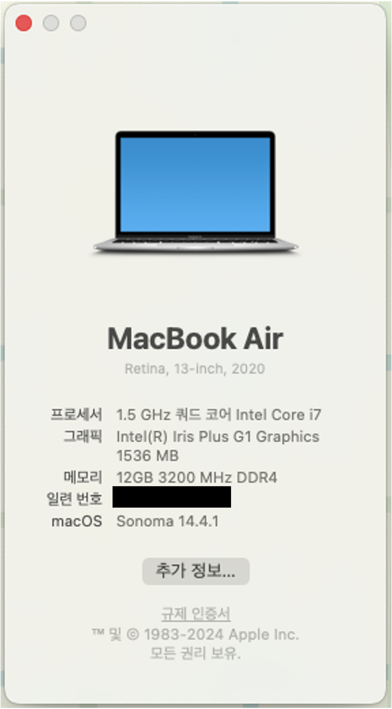

# ASUS-X515JA-10722-OpenCore

## Hardware Specs

| Components       | Model                     |
| ---------------- | ------------------------- |
| CPU              | Intel Core i7-1065G7      |
| RAM              | 12GB@3200MHz DDR4         |
| iGPU             | Intel(R) Iris Graphics G1 |
| WiFi & Bluetooth | ~~AW-CB515NF~~ BCM94360NG |
| Storage          | NVME 256GB                |

### Features

- [x] Graphics
- [x] USB Ports
- [x] Brightness control
- [x] TouchPad
- [x] Keyboard Fn Keys
- [x] Speakers
- [x] Audio Combo Jack (Use [ComboJack](https://github.com/hackintosh-stuff/ComboJack) if needed.)
- [x] Apple Services
- [x] WiFi
- [x] Bluetooth
- [x] Airdrop
- [x] Battery percentage (inaccurate)
- [ ] Webcam
- [ ] Sleep Mode
- [ ] HDMI
- [ ] Keyboard Backlight
- [ ] DRM (Apple Music working, however)
